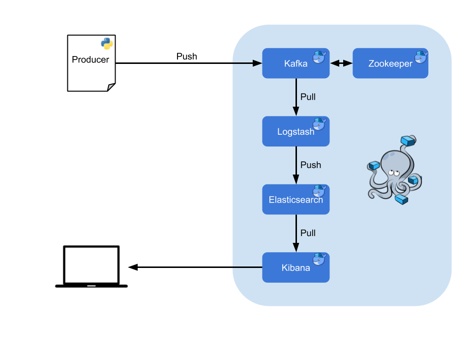

# Activity Monitor

Activity Monitor is a project aiming to monitor computer metrics with:

  - Docker & Docker-Compose
  - Kafka
  - ELK stack (6.5)
  - Python

This project is based on [docker-elk](https://github.com/deviantony/docker-elk) and [kafka-docker](https://github.com/wurstmeister/kafka-docker).

### Functionment
A python script send metrics (JSON format) to a Kafka Topic. Then Logstash will modify the event and ship it to the Elasticsearch instance that will index it. Once events are indexed, it is possible to visualise them with the Kibana UI.

The corresponding architecture is the following:

The urls of the services available from your computer are:

 - Kibana: http://localhost:5601/app/kibana
 - Elasticsearch: http://localhost:9200/ 
    

### Installation

Activity monitor requires Docker, Docker-compose and Python 3.

Launch the stack with the build option:

```sh
$ docker-compose up --build
```
Launch the metrics crawler:

```sh
$ cd ./scripts
$ python3 computer_info.py
```

Shutdown the application:

```sh
$ docker-compose down
```
### DIY

Want to monitor your own metrics? 
The Python script `computer_info.py` uses the [psutil](https://psutil.readthedocs.io/en/latest/) library. You can custom the metrics adding new values to the dictionnary activity.


